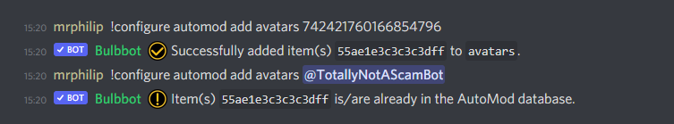

## What are avatar bans?
Avatar bans are an easy way to ban certain avatars from joining your server. For example known scam bot avatars or someone impersonating a user. 

Let's go through a quick guide on how to use it.

## How to use it?
First of all we need a user which avatar we want to ban. In our case we will use my alt account `TotallyNotAScamBot` with the this avatar 

We will now want to ban this avatar, as we have been seeing a lot of scam bots using this exact avatar when joining the server. We do this by running the following command `!configure automod add avatars <user>`

You can pass the user argument as a user id or a mention of the user (note that hash is the same in both cases).

We now have to add a punishment in case a user with this avatar joins the server. We do this with `!configure automod punishment avatars <LOG|WARN|KICK|BAN>`, in this example we will choice the `BAN` argument because we want to ban the users if they have this avatar.  

Lastly we have to enable the automod (in case its not already enabled in your server). We do this with the `!configure automod enable` command. In case you are unsure of what you have added to the settings you can always run the command `!configure automod settings` for a full list of the settings in your server.

Now we just have to wait until a user with this avatar joins the server and the bot will handle the rest.

For more information on how our automod works, we have a more detailed guide over [here](automod.md)