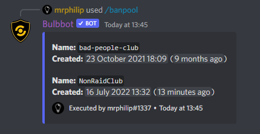

:::caution note
Banpools and crossbanning is a **premium** only command currently. For more information about premium take a look at our article about it over [here](./about-premium.md).

:::

## What are banpools and crossbanning?
Banpools are organized groups of servers that share a banning system together. Meaning that if a user is cross-banned in one server they will be banned in all other severs that are connected via banpools. 

Let's take a quick example:  
- Alice and Bob are friends, but they often need to ban similar bad people for breaking rules!  
- Alice creates a banpool with the name `bad-people-club`,
- Alice creates an invite and invites Bob to join the banpool (the 2 servers are now connected to each other).
- Bob crossbans a user in his server as he suspects that they will also join Alice's server and cause mischief.
- The user gets banned in both Bob's and Alice's server, easy and simple, no fuss!

## How to use it?
The process is split up into 2 parts. 
- First you need to create a banpool,
- Secondly you need to use the banpool ban command `crossban`.

Let's hop in, and we will guide you through the process, don't worry!

### Banpool Create
First we need to create a new banpool. We do this by using the command `!banpool create <pool name>`, here you will specify the name of the banpool you want to create.   

**OBS:** These names are globally unique, therefore 2 banpools of the same name **can't** exist. 

### Banpool Invite
Now, we've got our new banpool! But, we want to invite our friends to join it, so we are going to use the command `!banpool invite <pool name>`, this is will generate a single use invite code for your banpool that expires after 15 minutes. Then they just enter the `!banpool join <code>` command in their server and you guys are fully linked together. Ready to ban all the bad people!

### Banpool Join
Just enter the code you friend gave you, (or if they were very kind they gave you the entire command to paste!)

### Crossban
Now you and the servers that have joined the banpool are fully connected and ready to rock together. Using the banpool ban command `!crossban <user> <reason>` you are able to ban the user from all the servers that are connected via the banpool. 

### Banpool List
If you wish to view a full list of banpools you are subscribed to/a part of, run the `!banpool list` command.

### Banpool Leave
If you want leave a banpool, run the `!banpool leave <pool name>` command, and you'll be removed from it. If you accidentally leave just ask your friend for a new invite, and you will be back again.

### Banpool Remove
As the creator of a banpool you have the ability to run the 2 commands, one being: `!banpool remove <serverId>`. This removes the server from the banpool.

### Banpool Info
The other banpool creator command we have is `!banpool info <pool name>` which returns a list of all the data from the banpool and also which servers are connected to the banpool currently.

