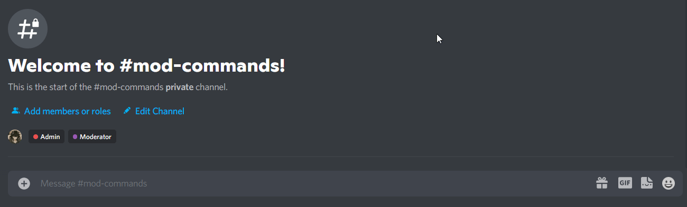

Instead of the traditional Trusted, Moderator and Administrator roles most other bots use for gating commands, BulbBot uses a **clearance system** that assigns each role and command a clearance value. This in theory with the ability to edit and change these clearance levels allows you to gate commands with **100** override.

### 0. Before you begin

Before you begin configuring and changing this clearance values please note that the `@everyone` role has a clearance level of `0` by default. This allows anyone with the `@everyone` role or any other role that does not have any special permissions to use commands that by default have a clearance level of `0`. Anyone with a role that has the `ADMINISTRATOR` permission grated will **automatically** be assigned a clearance value of `75`. The Server Owner will be granted a clearance level of `100` by default and is the only one that can use all BulbBot commands regardless of the command or role overrides.

:::caution note
Some commands are also affected by Discord's default permissions as well. This means that if a role has a clearance level of less than `50` but has the `BAN_MEMBERS` permission granted it'll be able to access any commands that require this permission i.e. `!ban`
:::

You can read through our [command list](command-list) for more information about what clearance level each command has.

### 1. The basics

BulbBot assigns each command a certain clearance level by default. These default clearance levels can either be `0`, `25`, `50` or `75` and sort our commands into **4** categories, commands that anyone can use, commands that only Trusted users can use, Moderator commands and Administrator commands. You can edit commands and roles to have whatever clearance level you choose however if you only want to have a Moderator, and an Administrator role you will never need to edit role clearances.

### 2. Editing role and command permissions

Now that you made sure you need to edit the role or command clearance levels you can do so using the `!configure override` command. You can add a custom clearance level to roles using `!configure override create role <name> <clearance>` or `!configure override create command <name> <clearance>` for commands. These overrides can also be edited using `!configure override edit <part> <name> <clearance>` or deleted using `!configure override delete <part> <name> <name>`.

:::tip
If you need to disable or enable command completely you can do so using `!configure override enable <command>` or `!configure override disable <command>`. Disabled commands will not trigger in your server until you re-enable them.
:::

### 3. Checking command overrides

If you ever forget about a command or role override you created or want to check on all the overrides you've created you can do so using the `!configure override list` command

