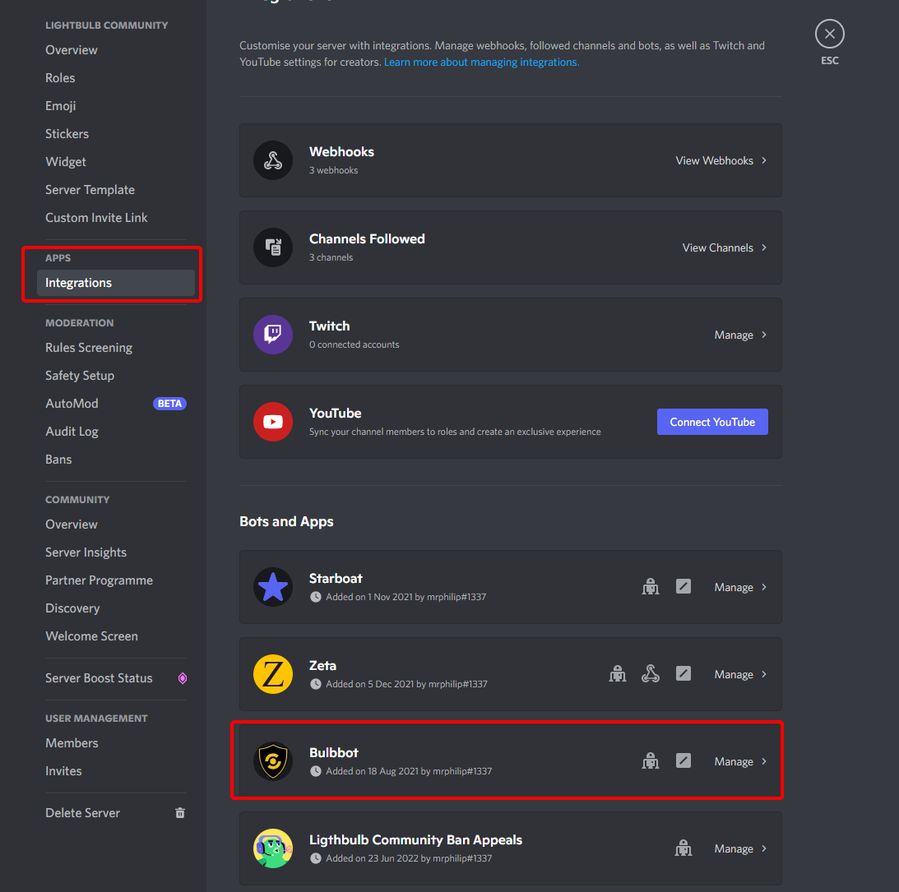
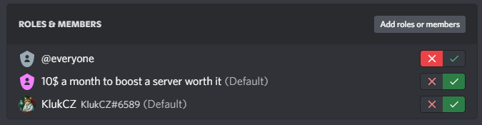
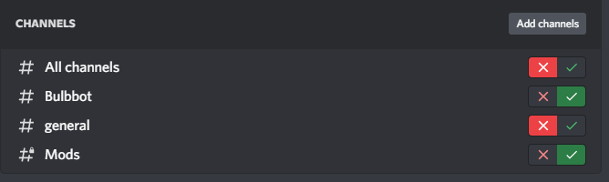
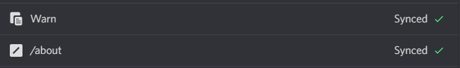
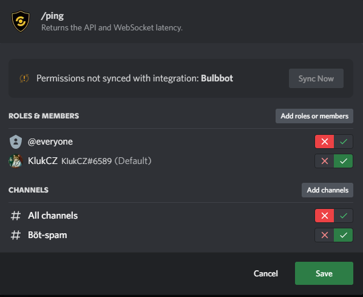

## How to handle Bulbbot permissions?

Bulbbot utilizes the built in Discord permission handler for **all** of its commands to make it easier for admins and us developers. And you want have
a situtation where users go ask wthat commands are what because they are hidden. So how does all this work? Its super easy and its all in the server
settings of your server!

## Quick guide on to configure permissions

First go to the Server settings of your server and in the "Apps" category you will find the "Integrations" tab press it. Scroll or search for Bulbbot

By default the permission will be what we as developers things are good settings. Like `/ban` should only be able to be used by people with the
`BAN_MEMBERS` permissions and so on. This will create a good starting point for everyone in your server.

:::note 
This will not show up in the server settings, so if you decide to configure a feature be aware that you might have to add or remove restirctions. 
:::

On the Bulbbot page there will be 3 different tabs you can configure so lets go through all of them one at a time.

### Roles & Members
This will determine which people are allowed to use **any (will disable all of them which does not meet this role requirement)** of the commands by the bot, by Discord default this will be everyone, but you can disable or enable it for just cerain people with roles like approve or trusted.

This also works if you just want to enable for a certain member.
   
Here we have disabled it for everyone and just people with the `10$ a month to boost a server worth it` role and user `KlukCZ#6589` are allowed to use commands on the bot.

### Channels
This will determine which channels are users allowed to use commands in, similare to Roles & Members you can disable or enable the commands in any channel you wish.

Here we have disabled it in All channels and in #general, but enabled it in #Bulbbot and #Mods

### Commands
The last tab but the most important one and the one you will spend the most time in is the Commands tab where you can configure all of the commands just like you want.
There are 2 different icons you will see here, `Warn` and `/about` are both commands but one is used users direcly called context command for more info about those read [this article](../basics/context-menu.md) and the other one is a normal slash command and for more info we got [this article](../basics/slash-commands.md)  

Lets go through one command too see how I would configure it. Lets take for example `/ping` for this example, so lets start with finding the command we can do this with the search bar or navigating the list and then we press it to bring up the configure menu. Here we can press and choice what roles or members should have access to the commands and in what channels the command should be accessable in. Super simple and easy to use for everyone.

And that is everything tada!!! 

*pssst users will not be able to see commands that they dont have access too so no more akward "You dont have access to this command"*