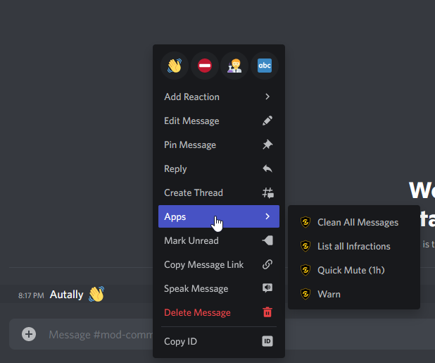

###  What are context menus?
In [August 2021](https://discord.com/developers/docs/interactions/application-commands#user-commands) Discord launched a new feature for bots, context menus. Context menus are a easy way for bots to interact with users or messages. 

_Bulbbot currently only supports context menus for messages_

### How do I use context menus?
It's super easy to use context menus. Just right click a message, hover over the "Apps" section, and select the moderation action you want to give to the user. Bulbbot currently offers these 5 actions as context menu commands:
- Ban
- Clean Messages
- Kick
- Quick Mute
- Warn

