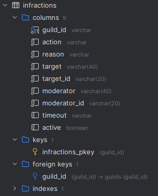

We utilize migrations to structure the database changes over time and make it easier to rollback features that was unexpected or not planned in a strucutred and controlled way.

## Creating new tables

In this example will we use the `bulbbot.Gateway` package to demonstrate. In the `bulbbot.Gateway` directory we need to go the `migration` directory, where the migrations are stored.

### Generating the migration file

```shell
$ cd bulbbot.Gateway
$ cd migration

$ cargo run generate <name of the migration> # in our case create_infraction_table

# Generating new migration...
# Creating migration file `./src\m20231105_163850_create_infraction_table.rs`
# Adding migration `m20231105_163850_create_infraction_table` to `./src\lib.rs
```

_The name of the migration must be in the_ `snake_casing`

Now after we have created a migration file will we find a new file called `m[current date]_[current time]_[migration name].rs` in the `/src` directory. Looking something like this

```rust
use sea_orm_migration::prelude::*;

#[derive(DeriveMigrationName)]
pub struct Migration;

#[async_trait::async_trait]
impl MigrationTrait for Migration {
    async fn up(&self, manager: &SchemaManager) -> Result<(), DbErr> { /* Code here */ }

    async fn down(&self, manager: &SchemaManager) -> Result<(), DbErr> { /* Code here */ }
}

#[derive(Iden)]
enum Post {
    Table,
    Id,
    Title,
    Text,
}
```

### Including the migration file

There is now a couple of things we would want to do before actually starting to write the migration. The first thing is to actually include the migration program. We do this in the `/src/libs.rs` file, where we have a vector of migrations. Copy the name of the new import at the top, that has the same name as your migration file (but without the `.rs`). Then just add to the vector in a `Box::new()`.

```rust
mod m20231105_163850_create_infraction_table;

...

fn migrations() -> Vec<Box<dyn MigrationTrait>> {
        vec![
            ...
            Box::new(m20231105_163850_create_infraction_table::Migration),
        ]
}
```

### Iden

We now want to move the [Iden enum](https://docs.rs/sea-query/latest/sea_query/#iden) to the `/src/models.rs` file, this makes it easier for us to do relationships between tables. Idens are used as traits for the table and express a column each, so we can update our iden to match our desired table. We will also give our iden a better name.

```rust
#[derive(Iden)]
pub enum Infractions {
    Table,
    GuildId,
    Action,
    Reason,
    Target,
    TargetId,
    Moderator,
    ModeratorId,
    Timeout,
    Active,
}
```

### Writing the migration

Now we can go back to the migration file `/src/m20231105_163850_create_infraction_table.rs`, to actually write the migration. The migration file has two methods.

- up, this is what we want the migration to change
- down, this is how to revert the migration

#### Up

We will start with writing the **up** part.

```rust
manager
    .create_table(
        Table::create()                         // here we are saying what action we want to take, in this case creating a table
            .table(Infractions::Table)          // Referecing the Iden and the table property
            .col(                               // creating a new column
                    ColumnDef::new(Infractions::GuildId)
                    .string()                   // what data value
                    .not_null()                 // can be removed if the value can be null
                    .primary_key(),             // the primary key
            )
            .foreign_key(                       // in case we want to create a refrence to another table
                    ForeignKey::create()        // we create a foreign key
                    .name("guild_id")           // the name of the column
                    .from(Infractions::Table, Infractions::GuildId) // where the key should come from in the current table
                    .to(Guilds::Table, Guilds::GuildId),            // wher ethe key should point to in the relationship
            )
            .col(ColumnDef::new(Infractions::Action).not_null().string()) // A new column that is a string and can't be null
            .col(ColumnDef::new(Infractions::Reason).not_null().string())
            .col(
                    ColumnDef::new(Infractions::Target)
                    .not_null()
                    .string()
                    .string_len(40), // Setting a max length on the column
            )
            .col(
                    ColumnDef::new(Infractions::TargetId)
                    .not_null()
                    .string()
                    .string_len(20),
            )
            .col(
                    ColumnDef::new(Infractions::Moderator)
                    .not_null()
                    .string()
                    .string_len(40),
            )
            .col(
                    ColumnDef::new(Infractions::ModeratorId)
                    .not_null()
                    .string()
                    .string_len(20),
            )
            .col(ColumnDef::new(Infractions::Timeout).string()) // A new column that can be null and is a string
            .col(ColumnDef::new(Infractions::Active).boolean())
            .to_owned(),
).await
```

#### Down

After we have written the up we know we need to write the **down**, incase we would want to revert this change.

```rust
manager  // In our case its very easy and to revert the change we can just drop the table
    .drop_table(Table::drop().table(Infractions::Table).to_owned())
    .await
```

### Applying the migration

Now that we have written the migration we need to apply it to the database. We can do this easily with `cargo run`

```shell
$ cargo run

# Applying all pending migrations
# Applying migration 'm20231105_163850_create_infraction_table'
# Migration 'm20231105_163850_create_infraction_table' has been applied
```



### Updating the entity

After we are done with applying the migration we want to generate a new database entity that we use in the code. So we have to go to the `entity` directory instead. And run a command.

:::note note
Don't forget to create a file called `.env` in root of the directory `/entity/.env` with a proprty of `DATABASE_URL` that should be the connection string to your database. Like the following:

`postgresql://DB_USER:DB_PASSWORD@DB_HOST:5432/DB_NAME`

You also need to install the **sea-orm-cli** to use this command, this can be done with the following command `cargo install sea-orm-cli`
:::

```shell
$ cd ..
$ cd entity
$ sea-orm-cli generate entity -o src/generated
```

And now are done!
