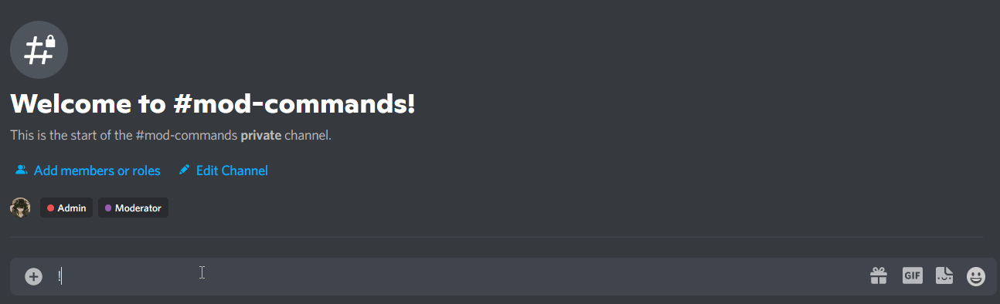
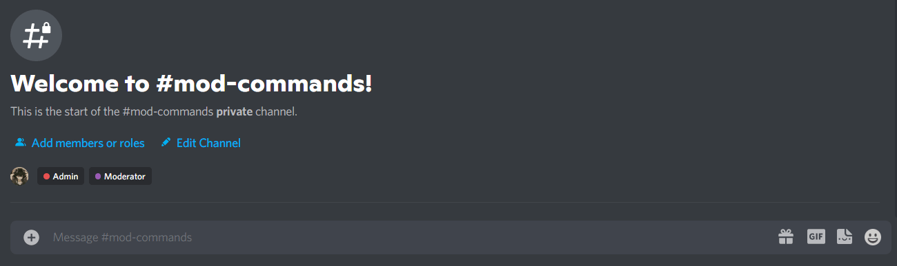

This guide will take you through a quick and simple way to add & set up BulbBot in your server!

### 1. Adding the bot to your server

You can find the invite link for BulbBot [here](https://bulbbot.mrphilip.xyz/invite).

### 2. Configuring BulbBot's prefix

By default, BulbBot will listen to `!` as it's prefix. We recognize that a wide variety of other bots also use `!` as their prefix, which could interfere with using BulbBot. You can change BulbBot's prefix in your server using the `!configure prefix <prefix>` command.

:::tip
You can ping BulbBot and it'll respond with what its prefix is in your server!
:::

### 3. Configuring logging

BulbBot comes with powerful logging features that allow you to log any actions in your server, from your Moderators taking actions on misbehavior, to role and channel updates, to even violations detected using BulbBot's AutoMod. You can configure logging channels using the `!configure logging <type> <channel>` command.

**Available logging types:** `mod_logs`, `automod`, `message_logs`, `role_logs`, `member_logs`, `channel_logs`, `thread_logs`, `invite_logs`, `join_leave`, `other` and `all`

### 4. Configuring the muted role

Dealing with spammers, trolls, and other problematic users joining your server can be a daunting task. At times, you or your Moderators might want to mute troublesome users to prevent them from causing more problems in your server. You can configure the muted role using the `!configure mute_role <role>` command.

Aaand you're done! :tada: You've just set up BulbBot's basic configuration in your server. There are of course many, many more configurable features BulbBot offers like Clearance Levels, Command and Role overrides, AutoMod, and much more. The guides and documentation for all of our features can also be found on this site!

### Additional Help
If you need any additional help, [join our support server!](https://bulbbot.mrphilip.xyz/discord)
