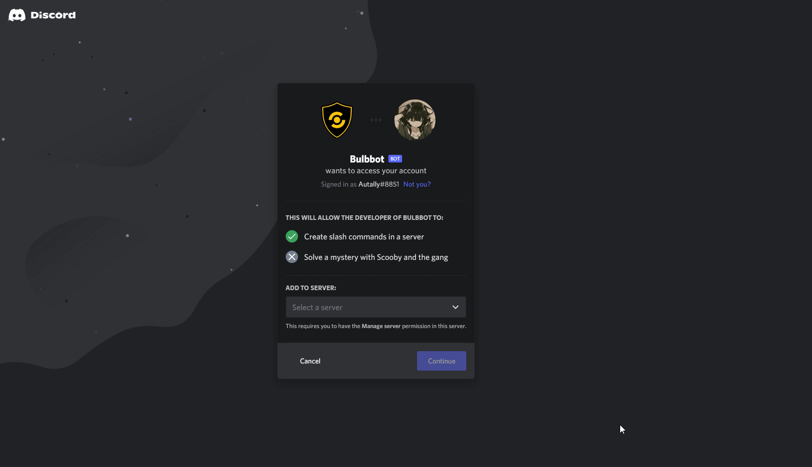
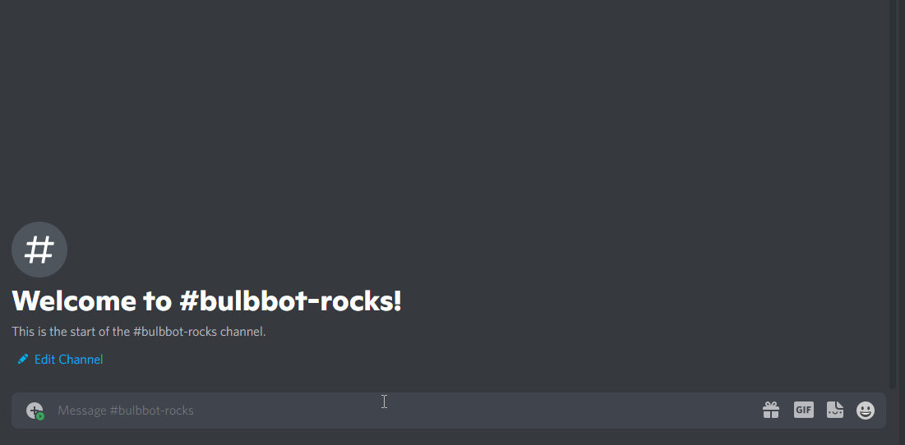

This guide will take you through a quick and simple way to add & set up Bulbbot in your server!

### 1. Adding the bot to your server

You can find the invite link for Bulbbot [here](https://bulbbot.rocks/invite).

### 2. Configuring logging

Bulbbot comes with powerful logging features that allow you to log any actions in your server, from your Moderators taking actions on misbehavior, to role and channel updates, to even violations detected using Bulbbot's AutoMod. You can configure logging channels using the `/configure` command.

**Available logging types:** `mod_logs`, `automod`, `banpool_logs`*, `message_logs`, `role_logs`, `member_logs`, `channel_logs`, `thread_logs`, `invite_logs`, `join_leave`, `other` and `all`

### 3. Some simple moderation commands
| Name                       | Description                               |
|----------------------------|-------------------------------------------|
| /kick                      | Kicks a member from the server            |
| /ban                       | Bans a member from the server             |
| /mute                      | Mutes a user for some amount of time      |
| /info                      | Gets some useful information about a user |
| /infraction offendersearch | Search the infractions of a given user    |

Aaand you're done! :tada: You've just set up Bulbbot's basic configuration in your server. There are of course many, many more configurable features Bulbbot offers like [Clearance Levels](clearance.md), Command and Role overrides, [Auto moderation](automod.md), and much more. The guides and documentation for all of our features can also be found on this site!

### Additional Help
If you need any additional help, [join our support server!](https://bulbbot.rocks/discord)
