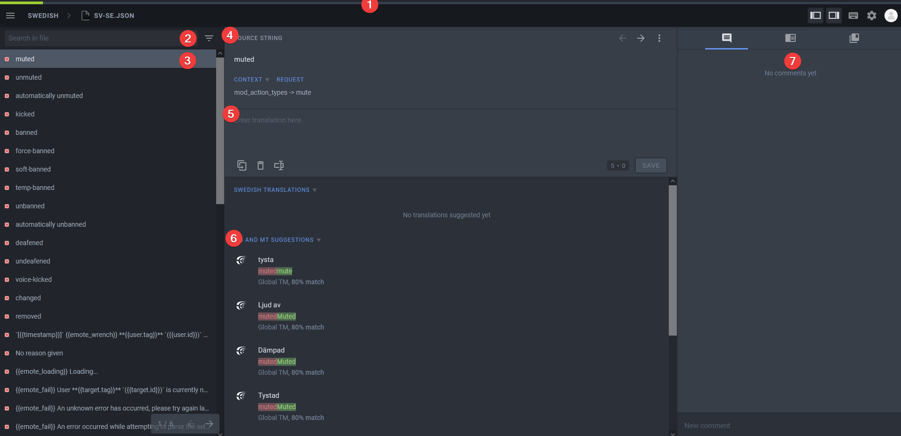
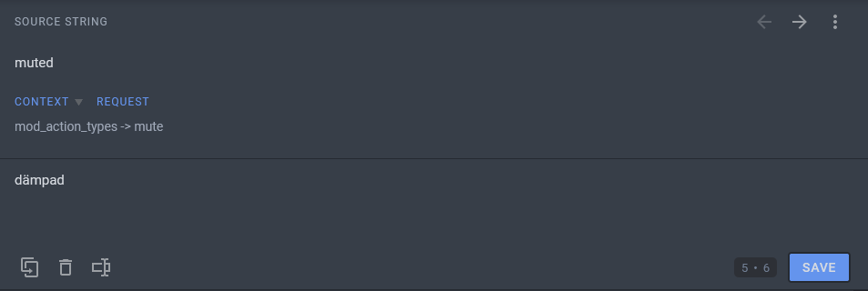

:::info note
We utilize [Crowdin](https://crowdin.com/) for translation to make it easier for us (the developers) and for you (the translator).
:::

## How to get started translating the bot
- Head over to https://i18n.bulbbot.rocks and create an account
- Select the language you want to translate (if your language does not show up please contact one of the developers in the [support server](https://bulbbot.rocks/discord) and we will add it in)

## What do some of the tabs mean in the translating screen

1: Progress made (blue is pending approval, green is approved, grey is missing)  
2: Search for a string  
3: The current selected strign   
4: Source string (in english)  
5: Your translation  
6: Suggestions made by the Crowdin AI  
7: Comments made on that string by other users  

## How to translate
Translating singular words is easy, just translate the word in the box. It's as simple as that!

If the word has the green `{{variable}}` placeholders, **don't** translate them, but do include them. Like shown in the example below.

Don't forget to save before moving on the on the next word.

## Error Messages
If you forgot to include a variable in a translated string this box will show up. Please include the variable in the string and the error will be resolved.  

