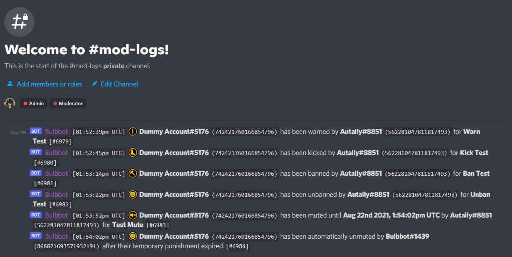
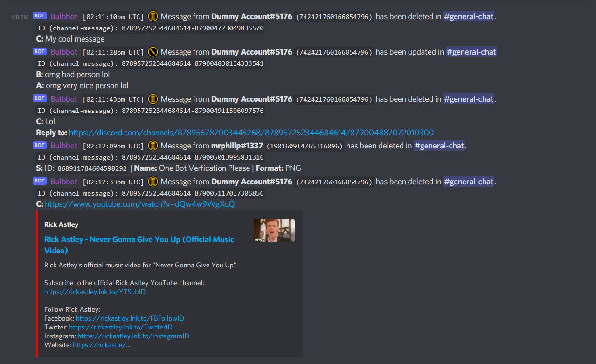
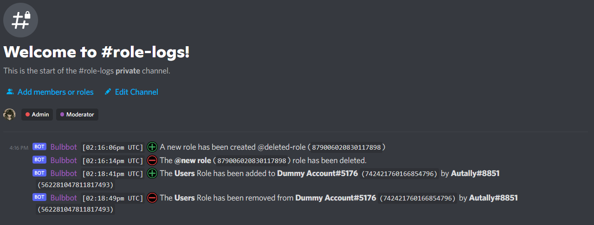
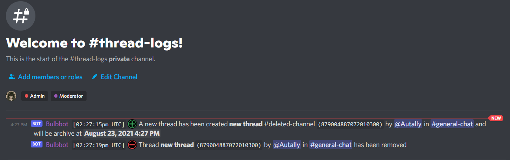
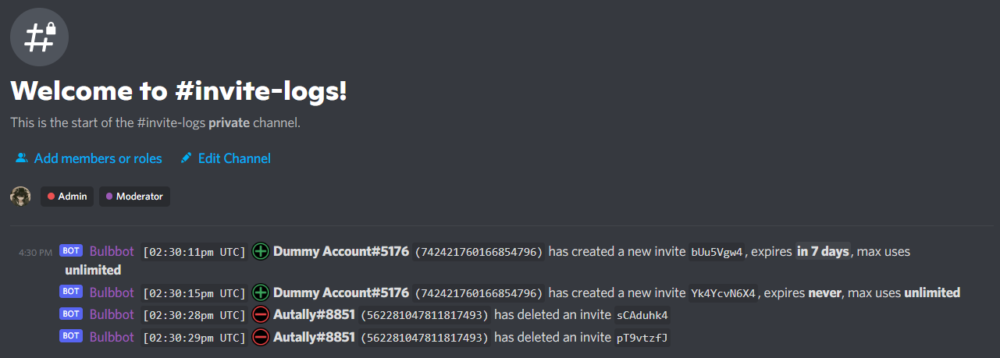
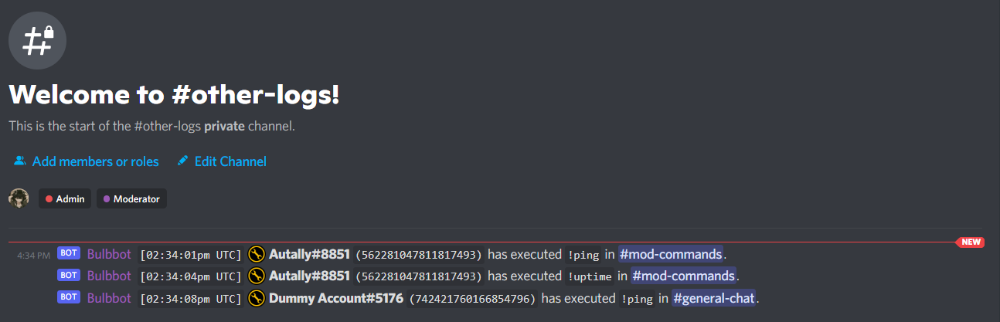

:::tip note
Bulbbot currently offers `10` logging types: `mod_logs`, `automod`, `message_logs`, `role_logs`, `member_logs`, `channel_logs`, `thread_logs`, `invite_logs`, `join_leave` and `other`
:::

### Mod Logs
Once enabled, `mod_logs` logging will log all mod actions performed by the bot in the selected channel. You can enable mod action logging using the
`!configuration logging mod_logs <channel>` command.

### Auto Mod
Automod logging will log all automod violations detected by Bulbbot in the selected channel. Bulbbot will additionally log which automated actions 
did it take and what was the detected content. You can configure automod logging using the `!configuration logging automod <channel>` command.

:::tip
You can learn more about Bulbbot's automod [here](automod.md)
:::

### Message logs
Message logging will log message upates in the server. You can enable message logging using `!configuration logging message_logs <channel>` command.
- Deleted messages (includes replies, stickers, embeds and attachements)
- Edited messages

### Role logs 
Role logs will log whenever an update happens to a role in the server. You can enable role logging using `!configuration logging role_logs <channel>` command (will in the future log role permission updates).

### Member logs
Member logs will log whenever an update happens to a member in the server. You can enable member logging using `!configuration logging member_logs <channel>` command. 

### Channel logs 
Channel logs will log whenever an update happens to a channel in the server. You can enable channel logging using `!configuration logging channel_logs <channel>` command (will in the future log channel permission updates).

### Thread Logs
Thread logs will log whenever a thread is created or deleted in the server. You can enable thread logging using `!configuration logging thread_logs <channel>` command (will in the future log whenever a user leaves or join a thread).

### Invite Logs
Invite logs will log whenever a invite is created or deleted in the server. You can enable invite logging using `!configuration logging invite_logs <channel>` command.

### Join/Leave logs
Join/leave logs will log whenever a user leaves or joins the server. You can enable it by using `!configuration logging join_leave <channel>` command.

### Other Logs
Other logs will log any other miscellaneous things listed below. You can enable it by using `!configuration logging other <channel>` command.
- Command Usage

