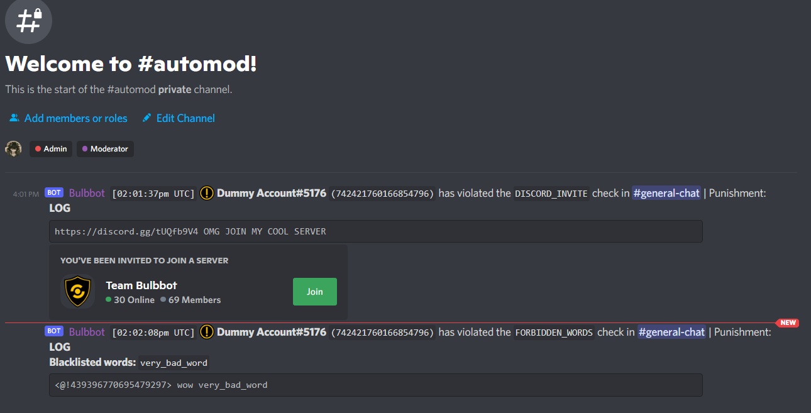
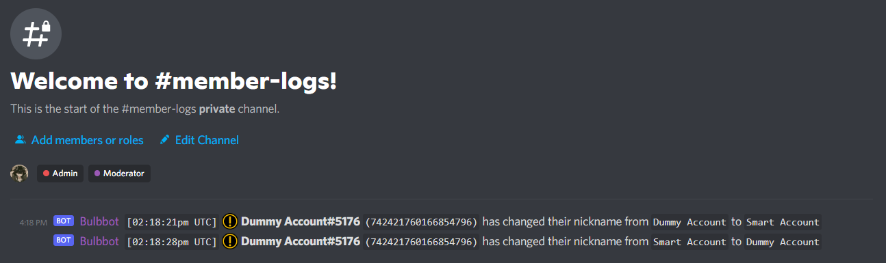
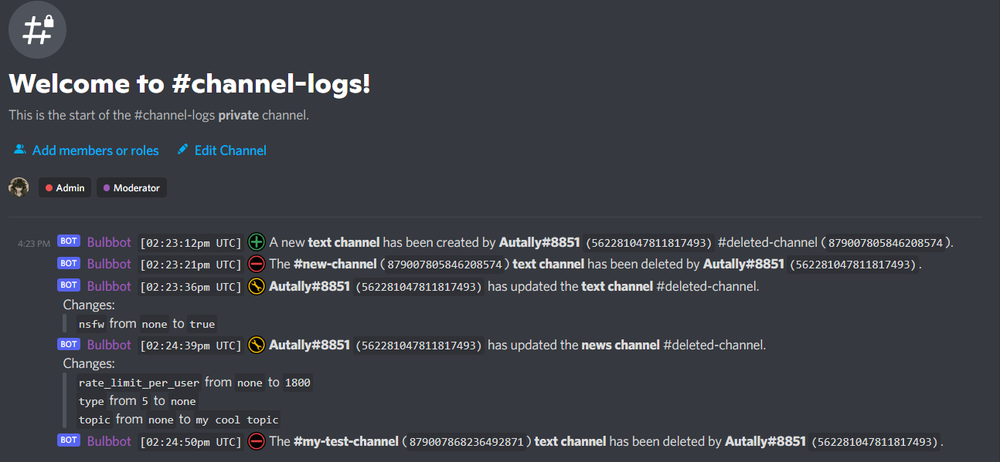
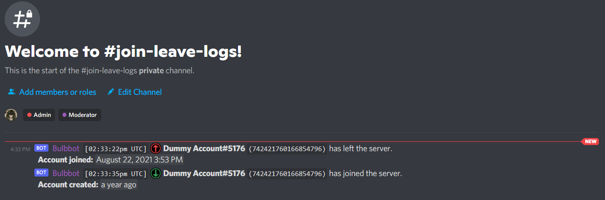

:::tip note
Bulbbot currently offers `11` logging types: `mod_logs`, `automod`, `banpool_logs`*, `message_logs`, `role_logs`, `member_logs`, `channel_logs`, `thread_logs`, `invite_logs`, `join_leave` and `other`
:::

### Mod Logs
Once enabled, `mod_logs` logging will log all mod actions performed by the bot in the selected channel. You can enable mod action logging using the `/configure logging type: Mod logs <channel>` command.

### Auto Mod
Automod logging will log all automod violations detected by Bulbbot in the selected channel. Bulbbot will additionally log which actions 
it took automatically, and the content it detected to trigger the automated action. You can configure automod logging using the `/configure logging type: Automod logs <channel>` command.

:::tip
You can learn more about Bulbbot's automod [here](automod.md)
:::

### Banpool Logs*
The banpool logs are available for the users who have a [premium](about-premium.md) server with [banpools](banpools.md) configured. It keeps track of the following
- Who is crossbanned (and where ban originated),
- When a user creates a banpool,
- When a user creates and invites a banpool,
- When another server joins the banpool.

### Message logs
Message logging will log message upates/edits in the server. You can enable message logging using `/configure logging type: Message logs <channel>` command.
- Deleted messages (includes replies, stickers, embeds and attachments),
- Edited messages.

### Role logs 
Role logs will log whenever an update happens to a role in the server. You can enable role logging using `/configure logging type: Role logs <channel>` command (Bulbbot in the future will log role permission updates too).

### Member logs
Member logs will log whenever a server member updates their server profile, i.e: nickname update. You can enable member logging using `/configure logging type: Member logs <channel>` command. 

### Channel logs 
Channel logs will log whenever an update happens to a channel in the server. You can enable channel logging using `/configure logging type: Channel logs <channel>` command (Bulbbot in the future will log channel permission updates).

### Thread Logs
Thread logs will log whenever a thread is created or deleted in the server. You can enable thread logging using `/configure logging type: Thread logs <channel>` command (Bulbbot in the future will log whenever a user leaves or joins a thread).

### Invite Logs
Invite logs will log whenever a invite is created or deleted in the server. You can enable invite logging using `/configure logging type: Invite logs <channel>` command.

### Join/Leave logs
Join/leave logs will log whenever a user leaves or joins the server. You can enable it by using `/configure logging type: Join/Leave logs <channel>` command.

### Other Logs
Other logs will log any other miscellaneous things listed below. You can enable it by using `/configure logging type: Other <channel>` command.
- Command Usage

