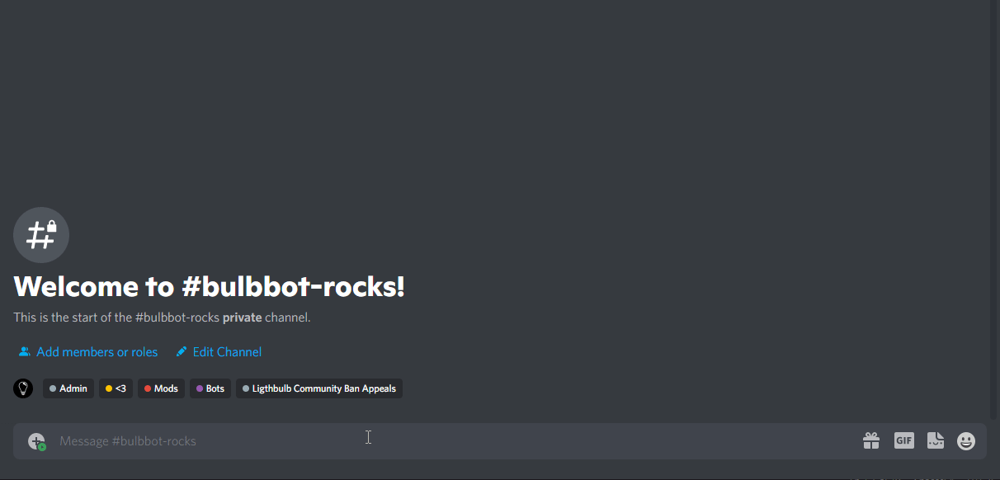
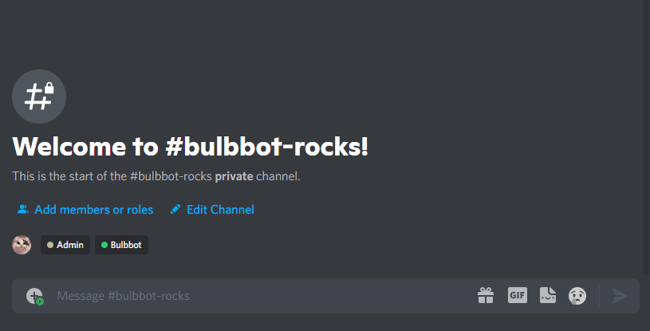

:::caution Experimatal Feature
This feature is current experimatal, and we are still working on improving it.
:::

## What are avatar bans?
Avatar bans are an easy way to prevent certain avatars from joining your server, by taking moderation actions upon them. For example known scam bot avatars or someone impersonating a user, you don't want them causing havoc in your server, so Avatar Banning punishes them for you!

Let's go through a quick guide on how to use it.

## How to use it?
First of all we need a user who's avatar we want to ban. In our case we will use an alt account `TotallyNotAScamBot` with the this avatar 

We will now want to ban this avatar, as we have been seeing a lot of scam bots using this exact avatar when joining the server. We do this by running the following command `!configure`.

You can pass the user argument as a user id or a mention of the user (note that the hash is the same in both cases).

We now have to add a punishment for when a user with this avatar joins the server. We can do this with `!configure`, in this example we will choose the `BAN` argument because we want to ban the users if they have this avatar.  

Lastly we need to enable the automod (assuming it's not already enabled in your server). We do this with the `!configure` command. If you are unsure of what your server's automod configuration is looking like, you can always run the command `!configure` for a full list of the settings in your server.

Now, you just have to wait until a user with this avatar joins the server and the bot will handle the rest.

For more information on how our automod works, we have a more detailed guide over [here](automod.md)
