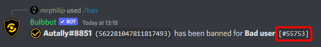
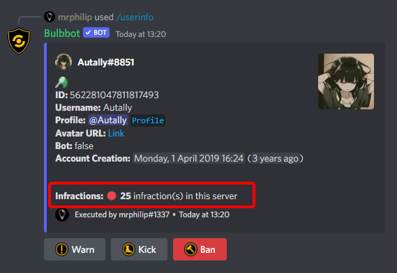

This article will guide you through what infractions are and how to use them with Bulbbot.

## What are infractions?
Infractions are the way you can keep track of what is happening without having to remember every single mod action that has occured on your server. Think of it like a large notepad of what is going on in your server.

An infraction is a number that is assigned to every single mod action that occurs, for example say BadUser#0000 was banned. The bot will then return a number, let's say in this case it's 140, as you can imagine, 140 would represent the infraction number assinged to the ban of BadUser#0000 in your server.
:::tip note
The infraction number increments globally.
:::

In the following example the user who was banned has the infraction id of `8413` assinged to that ban (the infraction id also shows in the log if you have mod logging enabled on your server).

## How to view infractions?
There is a couple of ways to search infractions in your server. So let's start and go through all of them.

`/userinfo [User]` The user info command will show the total amount of infractions a user has.  

`/infraction search <user> [page]` The best way to get a list of all of the infraction a user has. (Do note, Bulbbot will display a maximum of 25 infractions on each search. Use the page paramater to view more.)

`/infraction modsearch <user>` View what infractions a moderator has actioned with this command

## Other infraction commands
| Name                       | Description                                           |
|----------------------------|-------------------------------------------------------|
| /infraction delete         | To delete an infraction from a user                   |
| /infraction claim          | To change the moderator to yourself on a infraction   |
| /infraction claim          | Update the reasoning for the infraction               |
| /infraction offendersearch | Search the infractions of a given user                |