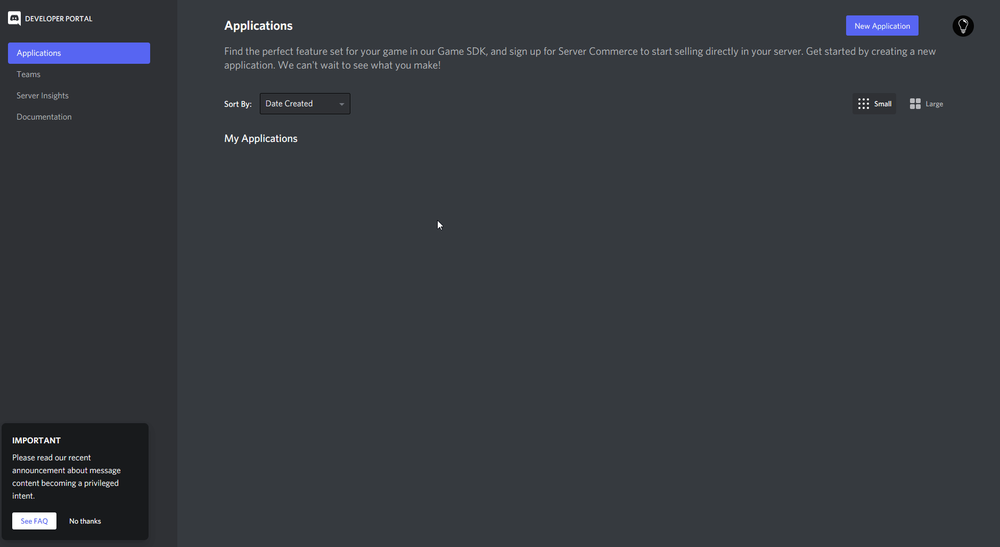

:::caution note

The code for Bulbbot is fully open sourced and we allow the community to contribute to the codebase.  
Please note that **you may not host your own version of Bulbbot publicly and or provide support for the bot in any way.**
You are however allowed to host a private version of the bot that can be used in private servers.

**We also offer 0 support on selfhosting the bot.**
:::

## Steps to configure a local development environment

### Prerequisites
- [PostgreSQL](https://www.postgresql.org/download/)
- [Node.JS (>16.0)](https://nodejs.org/en/)
- [Git](https://git-scm.com/downloads)
- *Optional* [Nodemon](https://nodemon.io/)

### Download the code
```shell
$ git clone https://github.com/TeamBulbbot/bulbbot.git
```

### Install packages
```shell
$ cd bulbbot
$ npm install # or yarn install
```

### Pre config
```shell
$ cd src
$ cp .env.example .env    # copy the .env.example and rename it to .env
$ vim .env                # fill out the env file with the credentials
$ vim Config.ts           # edit this to suite your needs
```

```shell
ENVIRONMENT=prod    # prod or dev

TOKEN=              # discord bot token

DB_NAME=            # the name of the database
DB_USER=            # the name of the user that connects to the database
DB_PASSWORD=        # the password of the user that connects to the database
DB_HOST=            # the ip address of the database (localhost for local dev)

SENTRY_DSN=         # the sentry dns url
```

### Setting up the Discord Bot
1. First go to https://discord.com/developers/applications (sign into with your Discord account if needed)
2. Press "New Application"
3. Give your application a name (in my case `Cool Bot Name`)
4. Copy the application id (in my case `892043097758912593`)
5. Head over to the "Bot" settings
6. Press "Add Bot"
7. Press "Yes, do it!"
8. Copy the bot token **KEEP THIS SAFE** (in my case `ODkyMDQzMDk3NzU4OTEyNTkz.Totally.Real.Token`, this is your Discord bot token)
9. Scroll down to "Privileged Gateway Intents"
10. Enable "Server Members Intent"
11. The bot can then be added to your server with the url  
https://discord.com/oauth2/authorize?client_id=APPLICATION_ID&permissions=261955644663&scope=bot+applications.commands



### Setting up the database
1. [Setup and install PostgreSQL](https://www.postgresqltutorial.com/install-postgresql/)
2. Open up `sql shell (psql)`
```
Server [localhost]:         # ip address of the database, localhost for local dev
Database [postgres]:        # default database, leave blank
Port [5432]:                # postgresql port, leave blank if default
Username [postgres]:        # default postgresql username, leave blank if default
Password for user postgres: # postgresql user password
```

```
$ SELECT version();                  # if you get output well done you have installed postgresql correctly
$ CREATE DATABASE <DATABASE_NAME>;   # name of the database you want your bot to connect to
```

3. Head back to the main repro and the main folder
```shell
$ npx tsc           # build the typescript files
$ npm run db-sync   # or yarn db-sync
```

### Running
```shell
$ npm run start     # or yarn start
$ npm run dev       # or yarn dev (if you have nodemon installed )
```


### Updating
```shell
$ git pull          # pull the latest code
$ npx tsc           # build the typescript files
# if there was a db change run the db-sync command again
$ npm run db-sync   # or yarn db-sync
```