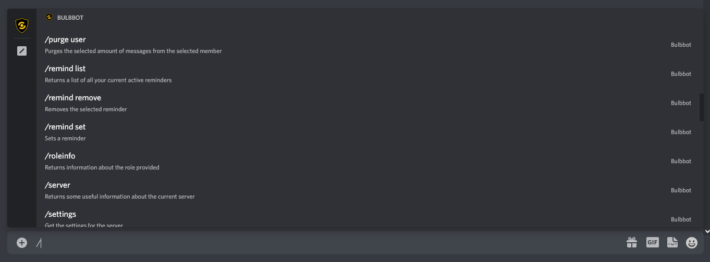

###  What are slash commands? 
In [December 2020](https://support.discord.com/hc/en-us/articles/1500000368501-Slash-Commands-FAQ), Discord launched a new feature for bot developers to make it easier to interact with bots. You can bring this menu up with `/`. 

Instead of spending hours trying to figure out the bots prefix or look through the help menu, just press `/`, find Bulbbot and rock on.

### How to use slash commands?
Like the name `/` slash. This will bring up the slash command menu, find the Bulbbot icon and press it. This will show all of the commands that Bulbbot offers.

